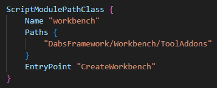

# DayZ-Dabs-Framework

Dabs Framework is a complete, open-source modding framework for DayZ Standalone. Created lovingly by [InclementDab](https://twitter.com/InclementDab)

## Using the Workbench Plugins

1. **Add ToolAddons to your project**
    - [DayZ-Mod-Template](https://github.com/InclementDab/DayZ-Mod-Template) users can skip this step
    - In your `dayz.gproj`, add the line `"DabsFramework/Workbench/ToolAddons"` to the Workbench script module
    

2. **Configure Project**
    - Set `Repository` setting in `(Plugins -> Configure Project)` (Example: `C:/Dev/proj/DayZ-Dabs-Framework`)

3. **Build Project**
    - Build the mod by navigating to `(Plugins -> Build Project)`

4. **Launch Project**
   - Launch the mod by navigating to `(Plugins -> Launch Game)`

    
Project Settings

- `Repository` The file path to your project's repository, containing your primary prefix folder. (Example: `C:/Dev/proj/DayZ-Dabs-Framework`)
- `Profiles` Path to directory where profiles will be generated
- `Missions` Path to directory where missions will be generated
- `Mods` Path to directroy where mods will be symlinked
- `LaunchType` Type of server launch mode
  - `CLIENT`: Only the client will launch
  - `SERVER`: Only the server will launch
  - `BOTH`: Both server and client will launch and connection
  - `OFFLINE`: Only the client will launch with a mission file

- `ServerPassword` Server password for auto-join
- `Map` Map to load (`ChernarusPlus`)
- `FilePatching` Create file patching sym-links from `prefixes.cfg` on game launch
- `Deloginator` Automatically delete logs when there are more than 5 in profiles
- `AutoClose` Automatically close game when re-launching

    
Build Settings
    

- `Command` Launch command to for project build. Command prompt syntax is %Command% -Mod=@OutputFolder InputFolder

    
Shortcuts

| Key          | Command                     |
|--------------|-----------------------------|
| <kbd>F6</kbd> | Launch Game |
| <kbd>F8</kbd> | Build Mod |
| <kbd>Ctrl</kbd> + <kbd>F6</kbd> | Configure Project |
| <kbd>Ctrl</kbd> + <kbd>F8</kbd> | Configure Build |
| <kbd>F5</kbd> | Join Remote Game |
| <kbd>F10</kbd> | Close Game |
| <kbd>Ctrl</kbd> + <kbd>N</kbd> | Create New File |
| <kbd>Ctrl</kbd> + <kbd>-</kbd> | Open Current Directory |
| <kbd>Ctrl</kbd> + <kbd>Shift</kbd> + <kbd>F2</kbd> | Rename Current File |
| <kbd>Ctrl</kbd> + <kbd>Shift</kbd> + <kbd>Delete</kbd> | Delete Current File |

You can find additional information on the [DayZ Workbench Wiki](https://community.bistudio.com/wiki/DayZ:Workbench_Script_Debugging)

## License

Your tool is licensed under [MIT License](LICENSE.md).

For any additional questions or feedback, please raise an issue in this repository or contact [Dab](mailto:inclementdab@gmail.com).
